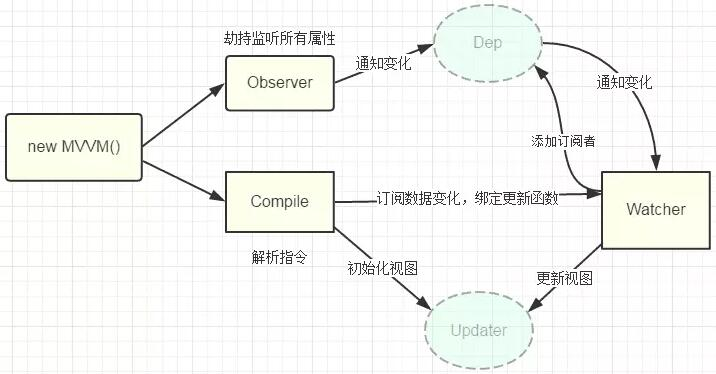

## MVC、MVVM

View 和 Model：

- View 很简单，就是用户看到的视图
- Model 同样很简单，一般就是本地数据和数据库中的数据

### MVC

传统的 MVC 架构通常是使用控制器更新模型，视图从模型中获取数据去渲染。当用户有输入时，会通过控制器去更新模型，并且通知视图进行更新。

但是 MVC 有一个巨大的缺陷就是控制器承担的责任太大了，随着项目愈加复杂，控制器中的代码会越来越臃肿，导致出现不利于维护的情况。

### MVVM

引入了 ViewModel 的概念。ViewModel 只关心数据和业务的处理，不关心 View 如何处理数据，在这种情况下，View 和 Model 都可以独立出来，任何一方改变了也不一定需要改变另一方，并且可以将一些可复用的逻辑放在一个 ViewModel 中，让多个 View 复用这个 ViewModel。

以 Vue 框架来举例：

- ViewModel 就是组件的实例。View 就是模板，Model 的话在引入 Vuex 的情况下是完全可以和组件分离的。
- 除了以上三个部分，其实在 MVVM 中还引入了一个隐式的 Binder 层，实现了 View 和 ViewModel 的绑定。
- 这个隐式的 Binder 层就是 Vue 通过解析模板中的插值和指令从而实现 View 与 ViewModel 的绑定。

对于 MVVM 来说，其实最重要的并不是通过双向绑定或者其他的方式将 View 与 ViewModel 绑定起来，而是 `通过 ViewModel 将视图中的状态和用户的行为分离出一个抽象`，这才是 MVVM 的精髓

## 虚拟 DOM

就是一个普通的 JavaScript 对象，包含了 tag(selector)、props(data)、children 三个属性

- 实现：

  1. 用 JavaScript 对象模拟真实 DOM 树，对真实 DOM 进行抽象；
  2. diff 算法 — 比较两棵虚拟 DOM 树的差异；
  3. pach 算法 — 将两个虚拟 DOM 对象的差异应用到真正的 DOM 树

- 优势：
  1. 保证性能下限: 虚拟 DOM 可以经过 diff 找出最小差异,然后批量进行 patch,这种操作虽然比不上手动优化,但是比起粗暴的 DOM 操作性能要好很多,因此虚拟 DOM 可以保证性能下限
  2. 无需手动操作 DOM: 虚拟 DOM 的 diff 和 patch 都是在一次更新中自动进行的,我们无需手动操作 DOM,极大提高开发效率
  3. 跨平台: 虚拟 DOM 本质上是 JavaScript 对象,而 DOM 与平台强相关,相比之下虚拟 DOM 可以进行更方便地跨平台操作,例如服务器渲染、移动端开发等等
  4. 实现组件的高度抽象化

## 前端路由

本质就是监听 URL 的变化，然后匹配路由规则，显示相应的页面，并且无须刷新

- hash 模式

  当 # 后面的哈希值发生变化时，不会向服务器请求数据，可以通过 hashchange 事件来监听到 URL 的变化，从而进行跳转页面

- history 模式

  - 利用 HTML5 中 history 提供的 pushState、replaceState 这两个 API。它们提供了操作浏览器历史栈的方法。pushState、replaceState 能够在不加载页面的情况下改变浏览器的 URL

  - 通过 pushState 和 replaceState 虽然能改变 URL，但是不会主动触发浏览器 reload。

  - pushState、replaceState 的区别是 history.pushState()是新增历史记录条目； history.replaceState()是修改（替换）当前历史记录条目 window.onpopstate 事件监听的是浏览器前进、后退事件

- 对比
  1. Hash 模式只可以更改 # 后面的内容，History 模式可以通过 API 设置任意的同源 URL
  2. History 模式可以通过 API 添加任意类型的数据到历史记录中，Hash 模式只能更改哈希值，也就是字符串
  3. Hash 模式无需后端配置，并且兼容性好。History 模式在用户手动输入地址或者刷新页面的时候会发起 URL 请求，后端需要配置 index.html 页面用于匹配不到静态资源的时候

## Vue

### 基本原理

当一个 Vue 实例创建时，vue 会遍历 data 选项的属性，用 Object.defineProperty（vue3.0 使用 proxy ）将它们转为 getter/setter 并且在内部追踪相关依赖，在属性被访问和修改时通知变化。 每个组件实例都有相应的 watcher 程序实例，它会在组件渲染的过程中把属性记录为依赖，之后当依赖项的 setter 被调用时，会通知 watcher 重新计算，从而致使它关联的组件得以更新。

### 响应式原理

1. 任何一个 Vue Component 都有一个与之对应的 Watcher 实例。
2. Vue 的 data 上的属性会被添加 getter 和 setter 属性。
3. 当 Vue Component render 函数被执行的时候, data 上会被 触碰(touch), 即被读, getter 方法会被调用, 此时 Vue 会去记录此 Vue component 所依赖的所有 data。(这一过程被称为依赖收集)
4. data 被改动时（主要是用户操作）, 即被写, setter 方法会被调用, 此时 Vue 会去通知所有依赖于此 data 的组件去调用他们的 render 函数进行更新。

通过数据劫持结合发布-订阅模式实现：

- 在初始化 data props 时，递归对象，给每一个属性双向绑定，对于数组而言，会拿到原型重写函数，实现手动派发更新。因为函数不能监听到数据的变动，和 proxy 比较一下。
- 除了以上数组函数，通过索引改变数组数据或者给对象添加新属性也不能触发，需要使用自带的 set 函数，这个函数内部也是手动派发更新
- 在组件挂载时，会实例化渲染观察者，传入组件更新的回调。在实例化过程中，会对模板中的值对象进行求值，触发依赖收集。在触发依赖之前，会保存当前的渲染观察者，用于组件含有子组件的时候，恢复父组件的观察者。触发依赖收集后，会清理掉不需要的依赖，性能优化，防止不需要的地方去重复渲染。
- 改变值会触发依赖更新，会将收集到的所有依赖全部拿出来，放入 nextTick 中统一执行。执行过程中，会先对观察者进行排序，渲染的最后执行。先执行 beforeupdate 钩子函数，然后执行观察者的回调。在执行回调的过程中，可能 watch 会再次 push 进来，因为存在在回调中再次赋值，判断无限循环。

1. 实现一个监听器 Observer：对数据对象进行遍历，包括子属性对象的属性，利用 Object.defineProperty() 对属性都加上 setter 和 getter。这样的话，给这个对象的某个值赋值，就会触发 setter，那么就能监听到了数据变化。

```js
function definereactive(obj, key, val) {
  var dep = new Dep()
  Object.defineProperty(obj, key, {
    get: function () {
      //添加订阅者watcher到主题对象Dep
      if (Dep.target) {
        // js的浏览器单线程特性，保证这个全局变量在同一时间内，只会有同一个监听器使用
        dep.addSub(Dep.target)
      }
      return val
    },
    set: function (newVal) {
      if (newVal === val) return
      val = newVal
      console.log(val)
      // 作为发布者发出通知
      dep.notify() //通知后dep会循环调用各自的update方法更新视图
    },
  })
}
function observe(obj, vm) {
  Object.keys(obj).forEach(function (key) {
    definereactive(vm, key, obj[key])
  })
}
```

2. 实现一个解析器 Compile：解析 Vue 模板指令，将模板中的变量都替换成数据，然后初始化渲染页面视图，并将每个指令对应的节点绑定更新函数，添加监听数据的订阅者，一旦数据有变动，收到通知，调用更新函数进行数据更新。

3. 实现一个订阅者 Watcher：Watcher 订阅者是 Observer 和 Compile 之间通信的桥梁 ，主要的任务是订阅 Observer 中的属性值变化的消息，当收到属性值变化的消息时，触发解析器 Compile 中对应的更新函数。

```js
function Watcher(vm, node, name, type) {
  Dep.target = this
  this.name = name
  this.node = node
  this.vm = vm
  this.type = type
  this.update()
  Dep.target = null
}
Watcher.prototype = {
  update: function () {
    this.get()
    this.node[this.type] = this.value // 订阅者执行相应操作
  },
  // 获取data的属性值
  get: function () {
    console.log(1)
    this.value = this.vm[this.name] //触发相应属性的get
  },
}
```

4.实现一个订阅器 Dep：订阅器采用 发布-订阅 设计模式，用来收集订阅者 Watcher，对监听器 Observer 和 订阅者 Watcher 进行统一管理。

```js
function Dep() {
  this.subs = []
}
Dep.prototype = {
  addSub: function (sub) {
    this.subs.push(sub)
  },
  notify: function () {
    this.subs.forEach(function (sub) {
      sub.update()
    })
  },
}
```

5. 

### 单项数据流

所有 prop 都使得其父子 prop 之间形成了一个单向下行绑定：父级 prop 的更新会向下流动到子组件中，但是反过来则不行。这样会防止从子组件意外修改父组件的状态。
额外的，每次父组件发生变更时，子组件中所有 prop 都将会刷新为最新的值。这意味着你不应该在一个子组件内部改变 prop。如果你这样做了，Vue 会在浏览器控制台中发出警告。子组件想修改时，只能通过 $emit 派发一个自定义事件，父组件接收到后，由父组件修改。

### 生命周期

1. 在 beforeCreate 钩子函数调用的时候，是获取不到 props 或者 data 中的数据的，因为这些数据的初始化都在 initState 中。

2. 然后会执行 created 钩子函数，在这一步的时候已经可以访问到之前不能访问到的数据，但是这时候组件还没被挂载，所以是看不到的。

3. 接下来会先执行 beforeMount 钩子函数，开始创建 VDOM，最后执行 mounted 钩子，并将 VDOM 渲染为真实 DOM 并且渲染数据。组件中如果有子组件的话，会递归挂载子组件，只有当所有子组件全部挂载完毕，才会执行根组件的挂载钩子。

4. 接下来是数据更新时会调用的钩子函数 beforeUpdate 和 updated，这两个钩子函数没什么好说的，就是分别在数据更新前和更新后会调用。

5. 另外还有 keep-alive 独有的生命周期，分别为 activated 和 deactivated 。用 keep-alive 包裹的组件在切换时不会进行销毁，而是缓存到内存中并执行 deactivated 钩子函数，命中缓存渲染后会执行 actived 钩子函数。

6. 最后就是销毁组件的钩子函数 beforeDestroy 和 destroyed。前者适合移除事件、定时器等等，否则可能会引起内存泄露的问题。然后进行一系列的销毁操作，如果有子组件的话，也会递归销毁子组件，所有子组件都销毁完毕后才会执行根组件的 destroyed 钩子函数。

### 组件通信

- 父子组件
  1. 父组件通过 props 传递数据给子组件，子组件通过 emit 发送事件传递数据给父组件（单项数据流）
  2. ref、$parent / $children 对象来访问组件实例中的方法和数据
  3. .sync 属性是个语法糖

```vue
<!--父组件中-->
<input :value.sync="value" />
<!--以上写法等同于-->
<input :value="value" @update:value="(v) => (value = v)" />
<!--子组件中-->
<script>
this.$emit('update:value', 1)
</script>
```

- 兄弟组件
  查找父组件中的子组件实现，也就是 this.$parent.$children，在 $children 中可以通过组件 name 查询到需要的组件实例，然后进行通信

- 跨层级组件

  1. provide / inject：祖先组件中通过 provider 来提供变量，然后在子孙组件中通过 inject 来注入变量。
  2. $attrs：包含了父作用域中不被 prop 所识别 (且获取) 的特性绑定 ( class 和 style 除外 )。当一个组件没有声明任何 prop 时，这里会包含所有父作用域的绑定 ( class 和 style 除外 )，并且可以通过 v-bind="$attrs" 传入内部组件。通常配合 inheritAttrs 选项一起使用。
  3. $listeners：包含了父作用域中的 (不含 .native 修饰器的) v-on 事件监听器。它可以通过 v-on="$listeners" 传入内部组件

- 任意组件
  Vuex 或者 Event Bus

### 渲染过程

- 初次渲染：

  1. 解析模板为 render 函数
  2. 触发响应式，监听 data 属性的 getter setter
  3. 执行 render 函数，会生成 vnode 并且渲染出页面

- 更新渲染：

  1. 修改 data，触发 setter
  2. 重新执行 render 函数，生成新的 vnode
  3. diff 算法对比新旧 vnode ，更新页面

- 异步渲染

Vue 是组件级更新，如果不采用异步更新，那么每次更新数据都会对当前组件进行重新渲染，所以为了性能， Vue 会在本轮数据更新后，在异步更新视图。核心思想 nextTick 。

dep.notify（） 通知 watcher 进行更新， subs[i].update 依次调用 watcher 的 update ， queueWatcher 将 watcher 去重放入队列， nextTick（ flushSchedulerQueue ）在下一 tick 中刷新 watcher 队列（异步）。

### 编译过程
  1. 将模板解析为 AST：
     通过各种各样的正则表达式去匹配模板中的内容，然后将内容提取出来做各种逻辑操作生成一个最基本的 AST 对象
  2. 优化 AST：
     对节点进行了静态内容提取，也就是将永远不会变动的节点提取了出来，实现复用 Virtual DOM，跳过对比算法的功能
  3. 将 AST 转换为 render 函数：
     遍历整个 AST，根据不同的条件生成不同的代码

### 性能优化

- v-if 和 v-show 区分使用场景
- computed 和 watch 区分使用场景
- v-for 遍历必须为 item 添加 key，且避免同时使用 v-if
- 长列表性能优化
- 事件的销毁
- 图片资源懒加载
- 路由懒加载
- 第三方插件的按需引入
- 优化无限列表性能
- 服务端渲染 SSR or 预渲染

### Diff
diff学习snabbdom.js
双端标记学习cito.js
vue的数据检测原理是可以知道哪里用到了某个数据，数据变化的时候可以直接通知到对应的 watcher 进行修改。那为什么还需要用 diff 算法呢？因为粒度太细，会有很多 watcher 同时观察某个状态，会有一些内存开销以及一些依赖追踪的开销，所以 Vue.js 2.0 采用了一个中等粒度的解决方案，状态侦测不再细化到某个具体节点，而是组件，组件内部通过虚拟DOM来渲染视图，这可以大大缩减依赖数量和 watcher 数量

在 Vue.js 2.0 版本中组件更新渲染的时候，会使用新创建的虚拟节点和将上一次渲染时缓存的虚拟节点进行对比，然后根据对比结果只更新需要更新的真实DOM节点，从而避免不必要的 DOM 操作，节省一定的性能。
在采取diff算法比较新旧节点的时候，比较只会在同层级进行, 不会跨层级比较。

diff 算法源码执行函数依次是：
- patch (oldVnode, vnode) ：
  - 调用sameVnode方法更具tag、key判断是否为相同元素：
  - 相同则走patchVnode()
  - 不同则创建新的删除旧的
- patchVnode (oldVnode, vnode)
  - 如果新旧节点都有children则调用updateChildren 
  - 否则通过对比新旧节点有无text和children来做相应的增删或更新
- updateChildren (parentElm, oldCh, newCh)

  通过`双端标记法`
  对比新老children的start和end是否相等，头头、尾尾、头尾、尾头

  如果四种都未命中则拿新children的开始的key去老children里找：
    - 没有的话直接添加
    - 有的话对比tag(sel)是否相等：
      - 不等则直接添加
       -相等的话，调用patchVnode后。将找到的old节点值为undefine，然后添加新的节点