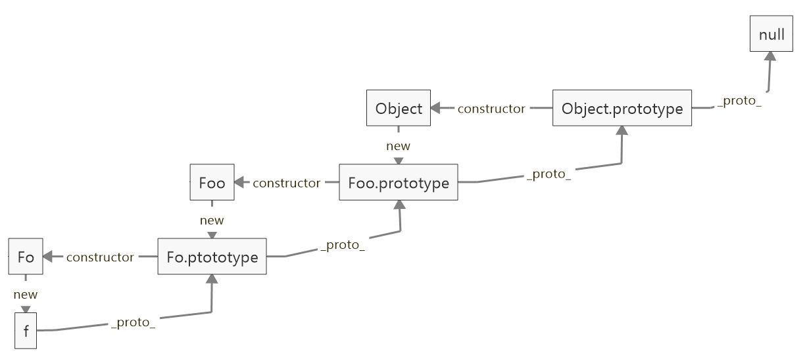

## JS 是如何运行的

JS 代码->解析成 AST (期间伴随词法分析、语法分析)->生成字节码（V8）->生成机器码（编译器）

## 数据类型

> JavaScript 共有七种基本数据类型，分别是 `Undefined、Null、Boolean、Number、String`，还有在 ES6 中新增的 `Symbol` 和 `BigInt` 类型

- `Symbol` 代表创建后独一无二且不可变的数据类型，它的出现我认为主要是为了解决可能出现的全局变量冲突的问题。
- `BigInt` 是一种数字类型的数据，它可以表示任意精度格式的整数，使用 `BigInt` 可以安全地存储和操作大整数，即使这个数已经超出了 `Number` 能够表示的安全整数范围。

这些数据可以分为原始数据类型和引用数据类型：

- 栈：原始数据类型（`Undefined、Null、Boolean、Number、String`）
- 堆：引用数据类型（`Object`对象、数组和函数）

两种类型的区别是：存储位置不同。

- 原始数据类型直接存储在栈（`stack`）中的简单数据段，占据空间小、大小固定，属于被频繁使用数据，所以放入栈中存储。
- 引用数据类型存储在堆（`heap`）中的对象，占据空间大、大小不固定。如果存储在栈中，将会影响程序运行的性能；引用数据类型在栈中存储了指针，该指针指向堆中该实体的起始地址。当解释器寻找引用值时，会首先检索其在栈中的地址，取得地址后从堆中获得实体。

堆和栈的概念存在于数据结构中和操作系统内存中：

- 在数据结构中，栈中数据的存取方式为先进后出。
- 堆是一个优先队列，是按优先级来进行排序的，优先级可以按照大小来规定。`完全二叉树`是堆的一种实现方式。

### BigInt

在 JS 中，所有的数字都以双精度 64 位浮点格式表示，只能安全地表示`-9007199254740991(-(2^53-1))`和`9007199254740991（(2^53-1)）`

```js
console.log(999999999999999) // 10000000000000000
9007199254740992 === 9007199254740993 // true
```

- 创建

```js
// 数字末尾加n
console.log(9007199254740995n) // → 9007199254740995n
console.log(9007199254740995) // → 9007199254740996

// 构造函数
BigInt('9007199254740995') // → 9007199254740995n
```

- 警惕
  1. BigInt 不支持一元加号运算符, 这可能是某些程序可能依赖于 + 始终生成 Number 的不变量，或者抛出异常。另外，更改 + 的行为也会破坏 asm.js 代码。
  2. 因为隐式类型转换可能丢失信息，所以不允许在 bigint 和 Number 之间进行混合操作。当混合使用大整数和浮点数时，结果值可能无法由 BigInt 或 Number 精确表示。

```js
10 + 10n // → TypeError
```

3. 不能将 BigInt 传递给 Web api 和内置的 JS 函数，这些函数需要一个 Number 类型的数字。尝试这样做会报 TypeError 错误。

```js
Math.max(2n, 4n, 6n) // → TypeError
```

4. 当 Boolean 类型与 BigInt 类型相遇时，BigInt 的处理方式与 Number 类似，换句话说，只要不是 0n，BigInt 就被视为 truthy 的值。

```js
if (0n) {
  //条件判断为false
}
if (3n) {
  //条件为true
}
```

5. 元素都为 BigInt 的数组可以进行 sort。
6. BigInt 可以正常地进行位运算，如|、&、<<、>>和^

## 数组和函数在内存中是如何存储的

1. 数组，JS 里的数组主要就是 以连续内存形式存储的`FixedArray`、以哈希表形式存储的`HashTable`。
2. 函数，函数属于引用数据类型，存储在堆中，在栈内存中只是存了一个地址来表示对堆内存中的引用。当解释器寻找引用值时，会首先检索其在栈中的地址，取得地址后从堆中获得实体。

## 类型判断

### typeof

对于基本类型，除了 null 都可以显示正确的类型

```js
typeof 1 // 'number'
typeof '1' // 'string'
typeof undefined // 'undefined'
typeof true // 'boolean'
typeof Symbol() // 'symbol'
typeof b // b 没有声明，但是还会显示 undefined
```

对于对象，除了函数都会显示 object

```js
typeof [] // 'object'
typeof {} // 'object'
typeof console.log // 'function'
```

对于 null 来说，虽然它是基本类型，但是会显示 object，这是一个存在很久了的 Bug

```js
// 在 JS 的最初版本中使用的是 32 位系统，为了性能考虑使用低位存储变量的类型信息，000 开头代表是对象
// 然而 null 表示为全零，所以将它错误的判断为 object

typeof null // 'object'
```

### instanceof

> 可以正确的判断对象的类型，因为内部机制是通过判断对象的原型链中是不是能找到类型的 prototype

```js
console.log(2 instanceof Number) // false
console.log(true instanceof Boolean) // false
console.log('str' instanceof String) // false
console.log([] instanceof Array) // true
console.log(function () {} instanceof Function) // true
console.log({} instanceof Object) // true
// console.log(undefined instanceof Undefined);
// console.log(null instanceof Null);
```

可以看出直接的字面量值判断数据类型， `instanceof` 可以精准判断引用数据类型（Array，Function，Object），而基本数据类型不能被`instanceof`精准判断。

在 MDN 中的解释：`instanceof`  运算符用来测试一个对象在其原型链中是否存在一个构造函数的  prototype  属性。其意思就是判断对象是否是某一数据类型（如 Array）的实例，请重点关注一下是判断一个对象是否是数据类型的实例。在这里字面量值，2， true ，'str'不是实例，所以判断值为 false。

- 实现分析

  1. 首先获取类型的原型
  2. 然后获得对象的原型
  3. 然后一直循环判断对象的原型是否等于类型的原型，直到对象原型为 null，因为原型链最终为 null

- 手撕

```js
function instanceOf(left, right) {
  let proto = right.prototype // 获取类型的原型
  left = left.__proto__ // 获取对象的原型
  // 判断对象的类型是否等于类型的原型
  while (true) {
    if (left === null || left === undefined) return false
    if (left === proto) return true
    left = left.__proto__
  }
}
```

### constructor

```js
console.log((2).constructor === Number) // true
console.log(true.constructor === Boolean) // true
console.log('str'.constructor === String) // true
console.log([].constructor === Array) // true
console.log(function () {}.constructor === Function) // true
console.log({}.constructor === Object) // true
```

但是如果创建一个对象，更改它的原型，那么它的 constructor 就会变得不可靠了

```js
function Fn() {}

Fn.prototype = new Array()

var f = new Fn()

console.log(f.constructor === Fn) // false
console.log(f.constructor === Array) // true
```

### Object.prototype.toString.call

> 使用 Object 对象的原型方法 toString ，使用 call 进行狸猫换太子，借用 Object 的 toString 方法

```js
var a = Object.prototype.toString

console.log(a.call(2)) // [object Number]
console.log(a.call(true)) // [object Boolean]
console.log(a.call('str')) // [object String]
console.log(a.call([])) // [object Array]
console.log(a.call(function () {})) // [object Function]
console.log(a.call({})) // [object Object]
console.log(a.call(undefined)) // [object Undefined]
console.log(a.call(null)) // [object Null]
```

## 内置对象

> js 中的内置对象主要指的是在程序执行前存在全局作用域里的由 js 定义的一些全局值属性、函数和用来实例化其他对象的构造函 数对象。

**全局的对象（ global objects ）**或称标准内置对象，不要和 **全局对象（global object）** 混淆。

这里说的全局的对象是说在全局作用域里的对象。全局作用域中的其他对象可以由用户的脚本创建或由宿主程序提供。

标准内置对象的分类:

- 1）**值属性**，这些全局属性返回一个简单值，这些值没有自己的属性和方法。

  例如：`Infinity、NaN、undefined、null` 字面量

- 2）**函数属性**，全局函数可以直接调用，不需要在调用时指定所属对象，执行结束后会将结果直接返回给调用者。

  例如：`eval()、parseFloat()、parseInt()` 等

- 3）**基本对象**，基本对象是定义或使用其他对象的基础。基本对象包括一般对象、函数对象和错误对象。

  例如：`Object、Function、Boolean、Symbol、Error` 等

- 4）**数字和日期对象**，用来表示数字、日期和执行数学计算的对象。

  例如：`Number、Math、Date`

- 5）**字符串**，用来表示和操作字符串的对象。

  例如：`String、RegExp`

- 6）**可索引的集合对象**，这些对象表示按照索引值来排序的数据集合，包括数组和类型数组，以及类数组结构的对象。

  例如：`Array`

- 7）**使用键的集合对象**，这些集合对象在存储数据时会使用到键，支持按照插入顺序来迭代元素。

  例如：`Map、Set、WeakMap、WeakSet`

- 8）**矢量集合**，`SIMD` 矢量集合中的数据会被组织为一个数据序列。

  例如：`SIMD` 等

- 9）**结构化数据**，这些对象用来表示和操作结构化的缓冲区数据，或使用 JSON 编码的数据。

  例如：`JSON` 等

- 10）**控制抽象对象**

  例如：`Promise、Generator` 等

- 11）**反射**

  例如：`Reflect、Proxy`

- 12）**国际化**，为了支持多语言处理而加入 ECMAScript 的对象。

  例如：`Intl、Intl.Collator` 等

- 13）**WebAssembly**

- 14）**其他**

  例如：`arguments`

## 闭包

> `红宝书`：闭包是指有权访问另外一个函数作用域中的变量的函数
>
> `MDN`： 闭包是指那些能够访问自由变量的函数

自由变量：在函数中使用的，但既不是函数参数 `arguments` 也不是函数的局部变量的变量，其实就是另外一个函数作用域中的变量

函数 A 内部有一个函数 B，函数 B 可以访问到函数 A 中的变量，那么函数 B 就是闭包

所有的函数都是闭包，因为有全局环境，所有的函数都可以访问全局变量

- 意义：让我们可以间接访问函数内部的变量

- 特性：

  1. 闭包可以访问当前函数以外的变量
  2. 即使外部函数已经返回，闭包仍能访问外部函数定义的变量
  3. 闭包可以更新外部变量的值

- 表现形式

  1. 返回一个函数。刚刚已经举例。
  2. 作为函数参数传递
  3. 在定时器、事件监听、Ajax 请求、跨窗口通信、Web Workers 或者任何异步中，只要使用了回调函数，实际上就是在使用闭包。
  4. IIFE(立即执行函数表达式)创建闭包, 保存了`全局作用域window`和`当前函数的作用域`，因此可以全局的变量。

## 作用域、作用域链

`作用域`：指的是一个变量和函数的作用范围，JS 中函数内声明的所有变量在函数体内始终是可见的，在 ES6 前有全局作用域和局部作用域，但是没有块级作用域（`catch` 只在其内部生效），局部变量的优先级高于全局变量

作用域是定义变量的区域，它有一套访问变量的规则，这套规则来管理浏览器引擎如何在当前作用域以及嵌套的作用域中根据变量（标识符）进行变量查找。

`作用域链`：当访问一个变量时，解释器会首先在当前作用域查找标示符，如果没有找到，就去父作用域找，直到找到该变量的标示符或者不在父作用域中，这就是作用域链

作用域链的作用是保证对执行环境有权访问的所有变量和函数的有序访问，通过作用域链，我们可以访问到外层环境的变量和函数。

作用域链的本质上是一个指向变量对象的指针列表。变量对象是一个包含了执行环境中所有变量和函数的对象。作用域链的前端始终都是当前执行上下文的变量对象。全局执行上下文的变量对象（也就是全局对象）始终是作用域链的最后一个对象。

当我们查找一个变量时，如果当前执行环境中没有找到，我们可以沿着作用域链向后查找。

## 变量提升

在生成执行环境时，会有两个阶段。第一个阶段是创建的阶段，JS 解释器会找出需要提升的变量和函数，并且给他们提前在内存中开辟好空间，函数的话会将整个函数存入内存中，变量只声明并且赋值为 `undefined`，所以在第二个阶段，也就是代码执行阶段，我们可以直接提前使用。

在提升的过程中，相同的函数会覆盖上一个函数，并且函数优先于变量提升

## 计算精度

> 为什么 `0.1 + 0.2 != 0.3 ？`
>
> 因为 JS 采用 `IEEE 754 双精度版本（64位）`，并且只要采用 `IEEE 754` 的语言都有该问题

0.1 在二进制中会表示为 `0.1 = 2^-4 * 1.10011(0011)`

很多十进制小数用二进制表示都是无限循环的，JS 采用的浮点数标准却会裁剪掉循环的数字，就会出现精度丢失的问题：

```js
0.100000000000000002 === 0.1 // true
0.200000000000000002 === 0.2 // true
0.1 + 0.2 === 0.30000000000000004 // true
```

console.log(0.1) 却是正确的？

因为在输入内容的时候，二进制被转换为了十进制，十进制又被转换为了字符串，在这个转换的过程中发生了取近似值的过程，所以打印出来的其实是一个近似值。

```js
console.log(0.100000000000000002) // 0.1
```

解决办法：

```js
parseFloat((0.1 + 0.2).toFixed(10)) === 0.3 // true
```

## 内存泄漏

- 意外的`全局变量`： 由于使用未声明的变量，而意外的创建了一个全局变量，而使这个变量一直留在内存中无法被回收。

- 被遗忘的`计时器`或`回调函数`： 设置了 `setInterval` 定时器，而忘记取消它，如果循环函数有对`外部变量`的引用的话，那么这个变量会被一直留在内存中，而无法被回收。

- 脱离 DOM 的引用： 获取一个 DOM 元素的引用，而后面这个元素被删除，由于一直保留了对这个元素的引用，所以它也无法被回收。

- `闭包`： 不合理的使用闭包，从而导致某些变量一直被留在内存当中。

## 垃圾回收机制

V8 实现了准确式 GC，GC 算法采用了分代式垃圾回收机制。这个机制又基于世代假说，这个假说有两个特点，一是新生的对象容易早死，另一个是不死的对象会活得更久。基于这个假说，因此，V8 将内存（堆）分为新生代和老生代两部分

新创建的对象或者只经历过一次的垃圾回收的对象被称为新生代。经历过多次垃圾回收的对象被称为老生代。

- 新生代：

新生代中的对象一般存活时间较短，使用 Scavenge GC 算法。

将内存空间分为两部分，分别为 From 空间和 To 空间。在这两个空间中，必定有一个空间是使用的，另一个空间是空闲的。新分配的对象会被放入 From 空间中，当 From 空间被占满时，新生代 GC 就会启动了。算法会检查 From 空间中存活的对象，如果满足条件则晋升到老生代，不满足则复制到 To 空间中，如果有失活的对象就会销毁。当复制完成后将 From 空间和 To 空间互换，这样 GC 就结束了

- 老生代

老生代中的对象一般存活时间较长且数量也多，使用两个算法：

1. 标记清除：先所有都加上标记，再把环境中引用到的变量去除标记。剩下的就是没用的了
2. 引用计数：跟踪记录每个值被引用的次数。清除引用次数为 0 的变量。(会有循环引用问题:循环引用如果大量存在就会导致内存泄露。)

出现在老生代的情况：

1. 新生代中的对象是否已经经历过一次 Scavenge 算法，如果经历过的话，会将对象从新生代空间移到老生代空间中。
2. To 空间的对象占比大小超过 25 %。在这种情况下，为了不影响到内存分配，会将对象从新生代空间移到老生代空间中。

## 私有变量

- 配置属性

```js
const obj = {
  name: '张三',
  getName() {
    return this.name
  },
}
object.defineProperty(obj, 'name', {
  configurable: false,
  enumerable: false,
})
```

- 闭包实现

```js
function Person(name) {
  var _name = name
  this.getName = function () {
    return this.name
  }
}
var p = new Person('张三')
console.log(p._name) // undefined
console.log(p.getName()) // '张三'
```

## 请求方法

### ajax

```js
const ajax = (url,method,async,data){
  return new Promise((resolve,reject)=>{
    const xhr = new XMLHttpRequest()
    xhr.onreadystatechange = ()=>{
      if(xhr.readyState === 4){
        if(xhr.status === 200){
          resolve(xhr.responseText)
        }else{
          reject(xhr.status)
        }
      }
    }
    xhr.open(method,url,async)
    xhr.send(data || null)
  })
}
```

### fetch

  - 优势：
    - 语法简洁，更加语义化
    - 基于标准 `Promise` 实现，支持 `async/await`
    - 同构方便，使用 `isomorphic-fetch`
    - 更加底层，提供的 API 丰富（`request, response`）
    - 脱离了`XHR`，是 ES 规范里新的实现方式
  - 缺陷：
    - fetch 只对网络请求报错，对 400，500 都当做成功的请求，服务器返回 400，500 错误码时并不会 `reject`，只有网络错误这些导致请求不能完成时，fetch 才会被 `reject`。
    - fetch 默认不会带`cookie`，需要添加配置项： `fetch(url, {credentials: 'include'})`
    - fetch 不支持`abort`，不支持超时控制，使用`setTimeout`及`Promise.reject`的实现的超时控制并不能阻止请求过程继续在后台运行，造成了流量的浪费
    - fetch 没有办法原生监测请求的进度，而`XHR`可以

### axios

1. 从浏览器中创建 `XMLHttpRequest`
2. 从 `node.js` 发出 `http` 请求
3. 支持 `Promise API`
4. 拦截请求和响应
5. 转换请求和响应数据
6. 取消请求
7. 自动转换 JSON 数据
8. 客户端支持防止 `CSRF/XSRF`
9. 提供了并发的封装 `axios.all()`，只需将一个请求数组传递给这个方法，然后使用`axios.spread()`将响应数组的属性分配给多个变量

前两个特性解释了为什么 Axios 可以同时用于浏览器和 Node.js 的原因，简单来说就是通过判断是服务器还是浏览器环境，来决定使用 XMLHttpRequest 还是 Node.js 的 HTTP 来创建请求，这个兼容的逻辑被叫做适配器，对应的源码在 lib/defaults.js 中，

```js
// defaults.js
function getDefaultAdapter() {
  var adapter
  if (typeof XMLHttpRequest !== 'undefined') {
    // For browsers use XHR adapter
    adapter = require('./adapters/xhr')
  } else if (
    typeof process !== 'undefined' &&
    Object.prototype.toString.call(process) === '[object process]'
  ) {
    // For node use HTTP adapter
    adapter = require('./adapters/http')
  }
  return adapter
}
```

以上是适配器的判断逻辑，通过侦测当前环境的一些全局变量，决定使用哪个 adapter。
其中对于 Node 环境的判断逻辑在我们做 ssr 服务端渲染的时候，也可以复用。

#### Adapter xhr

定位到源码文件 `lib/adapters/xhr.js`，先来看下整体结构

```js
module.exports = function xhrAdapter(config) {
  return new Promise(function dispatchXhrRequest(resolve, reject) {
    var requestData = config.data;

    var request = new XMLHttpRequest();

    request.open(config.method.toUpperCase(), buildURL(fullPath, config.params, config.paramsSerializer), true);
    request.onreadystatechange = function handleLoad() {}
    request.onabort = function handleAbort() {}
    request.onerror = function handleError() {}
    request.ontimeout = function handleTimeout() {}

    request.send(requestData);
  });
};
```

导出了一个函数，接受一个配置参数，返回一个 Promise。这就是 XMLHttpRequest 的使用姿势呀，先创建了一个 xhr 然后 open 启动请求，监听 xhr 状态，然后 send 发送请求。

展开看一下 Axios 对于 onreadystatechange 的处理

```js
request.onreadystatechange = function handleLoad() {
  if (!request || request.readyState !== 4) {
    return;
  }

  // The request errored out and we didn't get a response, this will be
  // handled by onerror instead
  // With one exception: request that using file: protocol, most browsers
  // will return status as 0 even though it's a successful request
  if (request.status === 0 && !(request.responseURL && request.responseURL.indexOf('file:') === 0)) {
    return;
  }

  // Prepare the response
  var responseHeaders = 'getAllResponseHeaders' in request ? parseHeaders(request.getAllResponseHeaders()) : null;
  var responseData = !config.responseType || config.responseType === 'text' ? request.responseText : request.response;
  var response = {
    data: responseData,
    status: request.status,
    statusText: request.statusText,
    headers: responseHeaders,
    config: config,
    request: request
  };

  settle(resolve, reject, response);

  // Clean up request
  request = null;
};
```

首先对状态进行过滤，只有当请求完成时（readyState === 4）才往下处理。
需要注意的是，如果 XMLHttpRequest 请求出错，大部分的情况下我们可以通过监听 onerror 进行处理，但是也有一个例外：当请求使用文件协议（file://）时，尽管请求成功了但是大部分浏览器也会返回 0 的状态码。

Axios 针对这个例外情况也做了处理。

请求完成后，就要处理响应了。这里将响应包装成一个标准格式的对象，作为第三个参数传递给了 settle 方法，settle 在 lib/core/settle.js 中定义

```js
function settle(resolve, reject, response) {
  var validateStatus = response.config.validateStatus;
  if (!response.status || !validateStatus || validateStatus(response.status)) {
    resolve(response);
  } else {
    reject(createError(
      'Request failed with status code ' + response.status,
      response.config,
      null,
      response.request,
      response
    ));
  }
};
```

对 Promise 的回调进行了简单的封装，确保调用按一定的格式返回

#### 防范CSRF

**范伪造请求的关键就是检查请求来源**，refferer 字段虽然可以标识当前站点，但是不够可靠，现在业界比较通用的解决方案还是在每个请求上附带一个 anti-CSRF token，这个的原理是攻击者无法拿到 Cookie，所以我们可以通过对 Cookie 进行加密（比如对 sid 进行加密），然后配合服务端做一些简单的验证，就可以判断当前请求是不是伪造的。

```js
// Add xsrf header
// This is only done if running in a standard browser environment.
// Specifically not if we're in a web worker, or react-native.
if (utils.isStandardBrowserEnv()) {
  // Add xsrf header
  var xsrfValue = (config.withCredentials || isURLSameOrigin(fullPath)) && config.xsrfCookieName ?
    cookies.read(config.xsrfCookieName) :
    undefined;

  if (xsrfValue) {
    requestHeaders[config.xsrfHeaderName] = xsrfValue;
  }
}
```

#### 拦截器 Interceptor

```js
// 拦截器可以拦截请求或响应
// 拦截器的回调将在请求或响应的 then 或 catch 回调前被调用
var instance = axios.create(options);

var requestInterceptor = axios.interceptors.request.use(
  (config) => {
    // do something before request is sent
    return config;
  },
  (err) => {
    // do somthing with request error
    return Promise.reject(err);
  }
);

// 移除已设置的拦截器
axios.interceptors.request.eject(requestInterceptor)
```

那么拦截器是怎么实现的呢？定位到源码 lib/core/Axios.js 第 14 行

```js
function Axios(instanceConfig) {
  this.defaults = instanceConfig;
  this.interceptors = {
    request: new InterceptorManager(),
    response: new InterceptorManager()
  };
}
```

拦截器 interceptors 中的 request 和 response 两者都是一个叫做 InterceptorManager 的实例,定位到源码 lib/core/InterceptorManager.js

```js
function InterceptorManager() {
  this.handlers = [];
}

InterceptorManager.prototype.use = function use(fulfilled, rejected, options) {
  this.handlers.push({
    fulfilled: fulfilled,
    rejected: rejected,
    synchronous: options ? options.synchronous : false,
    runWhen: options ? options.runWhen : null
  });
  return this.handlers.length - 1;
};

InterceptorManager.prototype.eject = function eject(id) {
  if (this.handlers[id]) {
    this.handlers[id] = null;
  }
};

InterceptorManager.prototype.forEach = function forEach(fn) {
  utils.forEach(this.handlers, function forEachHandler(h) {
    if (h !== null) {
      fn(h);
    }
  });
};
```

**InterceptorManager 是一个简单的事件管理器**，实现了对拦截器的管理，通过 handlers 存储拦截器，然后提供了添加，移除，遍历执行拦截器的实例方法，存储的每一个拦截器对象都包含了作为 Promise 中 resolve 和 reject 的回调以及两个配置项。

值得一提的是，移除方法是**通过直接将拦截器对象设置为 null 实现的**，而不是 splice 剪切数组，遍历方法中也增加了相应的 null 值处理。这样做一方面使得每一项ID保持为项的数组索引不变，另一方面也避免了重新剪切拼接数组的性能损失。

# 函数

## 定义方法

1. 函数声明

函数声明有预解析,而且函数声明的优先级高于变量

```js
//ES5
function getSum(){}
function (){}//匿名函数
//ES6
()=>{}//如果{}内容只有一行{}和return关键字可省,
```

2. 函数表达式(函数字面量)

```js
//ES5
var sum = function () {}
//ES6
let sum = () => {} //如果{}内容只有一行{}和return关键字可省,
```

3. 构造函数

使用 Function 构造函数定义函数的方式是一个函数表达式,这种方式会导致解析两次代码，影响性能。第一次解析常规的 JavaScript 代码，第二次解析传入构造函数的字符串

```js
const sum = new Function('a', 'b', 'return a + b')
```

## this

> 绑定优先级 new > 显示 > 隐示

1. 默认绑定：全局环境中，`this` 默认绑定到 `window`。
2. 隐式绑定：一般地，被直接对象所包含的函数调用时，也称为方法调用，`this` 隐式绑定到该直接对象。
   隐式丢失：隐式丢失是指被隐式绑定的函数丢失绑定对象，从而默认绑定到 `window`。
3. 显式绑定：通过 `call()、apply()、bind()` 方法把对象绑定到 `this` 上，叫做显式绑定。
4. new 绑定：如果函数或者方法调用之前带有关键字 `new`，它就构成构造函数调用。对于 `this` 绑定来说，称为 `new` 绑定。

### call

> `call()` 方法使用一个指定的 `this` 值和单独给出的一个或多个参数来调用一个函数。

- 应用：

  1. 对象的继承
  2. 借用方法：类数组使用`Array`原型链上的方法

- 实现分析：

  1. 首先 `context` 为可选参数，如果不传的话默认上下文为 `window`
  2. 接下来给 `context` 创建一个 `fn` 属性，并将值设置为需要调用的函数
  3. 因为 `call` 可以传入多个参数作为调用函数的参数，所以需要将参数剥离出来
  4. 然后调用函数并将对象上的函数删除

- 手撕：

```js
Function.prototype.myCall = function (context) {
  if (typeof this !== 'function') {
    throw new TypeError('Error')
  }
  context = context || window
  context.fn = this
  const args = [...arguments].slice(1)
  const result = context.fn(...args)
  delete context.fn
  return result
}
```

### apply

> `apply()` 方法调用一个具有给定 this 值的函数，以及作为一个数组（或类似数组对象）提供的参数。

- 应用：

  1. `Math.max`。用它来获取数组中最大的一项
  2. 实现两个数组合并。在 ES6 的扩展运算符出现之前，我们可以用`Array.prototype.push`来实现。

- 手撕：

```js
Function.prototype.myApply = function (context) {
  if (typeof this !== 'function') {
    throw new TypeError('Error')
  }
  context = context || window
  context.fn = this
  let result
  if (arguments[1]) {
    result = context.fn(...arguments[1])
  } else {
    result = context.fn()
  }
  delete context.fn
  return result
}
```

### bind

> `bind()` 方法创建一个新的函数，在 `bind()` 被调用时，这个新函数的 `this` 被指定为 `bind()` 的第一个参数，而其余参数将作为新函数的参数，供调用时使用。

- 实现分析：

1. 前几步和之前的实现差不多，就不赘述了
2. bind 返回了一个函数，对于函数来说有两种方式调用，一种是直接调用，一种是通过 `new` 的方式，我们先来说直接调用的方式
3. 对于直接调用来说，这里选择了 `apply` 的方式实现，但是对于参数需要注意以下情况：因为 `bind` 可以实现类似这样的代码 `f.bind(obj, 1)(2)`，所以我们需要将两边的参数拼接起来，于是就有了这样的实现 `args.concat(...arguments)`
4. 最后来说通过 `new` 的方式，在之前的章节中我们学习过如何判断 `this`，对于 `new` 的情况来说，不会被任何方式改变 `this`，所以对于这种情况我们需要忽略传入的 `this`

- 手撕：

```js
Function.prototype.myBind = function (context) {
  if (typeof this !== 'function') {
    throw new TypeError('Error')
  }
  const self = this
  const args = [...arguments].slice(1)
  return function F() {
    if (this instanceof F) {
      return new self(...args, ...arguments)
    }
    return self.apply(context, args.concat(...arguments))
  }
}
```

## 防抖

即短时间内大量触发同一事件，只会执行一次函数，实现原理为设置一个定时器，约定在 xx 毫秒后再触发事件处理，`每次触发事件都会重新设置计时器`，直到 xx 毫秒内无第二次操作。

常用于搜索框/滚动条的监听事件处理，如果不做防抖，每输入一个字/滚动屏幕，都会触发事件处理，造成性能浪费。

- 手撕：

```js
function debounce(func, wait) {
  let timeout = null
  return function () {
    let context = this
    let args = arguments
    if (timeout) clearTimeout(timeout)
    timeout = setTimeout(() => {
      func.apply(context, args)
    }, wait)
  }
}
```

## 节流

防抖是延迟执行，而节流是间隔执行，函数节流即每隔一段时间就执行一次，实现原理为设置一个定时器，约定 xx 毫秒后执行事件，如果时间到了，那么执行函数并重置定时器，和防抖的区别在于，防抖每次触发事件都重置定时器，而节流在`定时器到时间后再清空定时器`

节流可以使用在 scroll 函数的事件监听上

- 手撕：

```js
function throttle(func, wait) {
  let timeout = null
  return function () {
    let context = this
    let args = arguments
    if (!timeout) {
      timeout = setTimeout(() => {
        timeout = null
        func.apply(context, args)
      }, wait)
    }
  }
}
```

## 原型、原型链

《你不知道的 javascript》对原型的描述：

> javascript 中的对象有一个特殊的 [[Prototype]] 内置属性，其实就是对其他对象的引用。几乎所有的对象在创建时 [[Prototype]] 都会被赋予一个非空的值。

《javascript 高级程序设计》这样描述原型：

> 每个函数都会创建一个 prototype 属性，这个属性是一个对象，包含应该由特定引用类型的实例共享的属性和方法。实际上，这个对象就是通过调用构造函数创建的对象的原型。使用原型对象的好处是，在它上面定义的属性和方法都可以被对象实例共享。原来在构造函数中直接赋给对象实例的值，可以直接赋值给它们的原型。

`原型`：当构造函数被创建时，会在内存空间新建一个对象，构造函数内有一个属性 `prototype` 会指向这个对象的存储空间，这个对象称为构造函数的原型对象

除了 `Function.prototype.bind()` 之外每个函数都有 `prototype` 属性就是原型，原型的 `constructor` 属性指向构造函数，构造函数又通过 `prototype` 属性指回原型

`原型链`：每个对象拥有一个原型对象，通过 `__proto__` 指针指向上一个原型 ，并从中继承方法和属性，同时原型对象也可能拥有原型，这样一层一层，最终指向 null，这种关系被称为原型链 (prototype chain)

1. `Object` 是所有对象的爸爸，所有对象都可以通过 `__proto__` 找到它
2. `Function` 是所有函数的爸爸，所有函数都可以通过 `__proto__` 找到它
3. `Function.prototype` 和 `Object.prototype` 是两个特殊的对象，他们由引擎来创建
4. 除了以上两个特殊对象，其他对象都是通过构造器 `new` 出来的



- 构造函数、原型和实例的关系是这样的：
  每个`构造函数`都有一个`原型对象`（实例的原型），`原型`有一个`constructor`属性指回`构造函数`，而`实例`有一个内部指针指向原型。 在 chrome、firefox、safari 浏览器环境中这个指针就是`__proto__`，其他环境下没有访问`[[Prototype]]`的标准方式

## new

> `new`关键字就是绑定了实例与原型的关系，并且在实例的的上下文中调用构造函数

- 实现分析：

  1. 创建一个空对象
  2. 获取构造函数
  3. 设置空对象的原型
  4. 绑定 `this` 并执行构造函数
  5. 确保返回值为对象

- 手撕：

```js
function myNew() {
  const obj = {}
  //取得该方法的第一个参数(并删除第一个参数)，该参数是构造函数
  const constructor = [].shift.call(arguments)
  //将新对象的内部属性__proto__指向构造函数的原型，这样新对象就可以访问原型中的属性和方法
  obj.__proto__ = constructor.prototype
  //取得构造函数的返回值
  const result = constructor.apply(obj, arguments)
  //如果返回值是一个对象就返回该对象，否则返回构造函数的一个实例对象
  return result instanceof Object ? result : obj
}
```

## 继承

> 继承是面向对象编程的三大特征之一（封装、继承、多态）。多个类中存在相同的属性和行为时，将这些内容抽取到单独一个类中，那么多个类无需再定义这些属性和行为，只需要继承那个类即可。多个类可以称为子类，单独这个类称为父类或者超类，基类等。子类可以直接访问父类中的非私有的属性和行为。

在其他面向类语言中，继承意味着复制操作，子类是实实在在地将父类的属性和方法复制了过来，但 javascript 中的继承不是这样的。根据原型的特性，js 中继承的本质是一种委托机制，对象可以将需要的属性和方法委托给原型，需要用的时候就去原型上拿，这样多个对象就可以共享一个原型上的属性和方法，这个过程中是没有复制操作的。

javascript 中的继承主要还是依靠于原型链，原型处于原型链中时即可以是某个对象的原型也可以是另一个原型的实例，这样就能形成原型之间的继承关系。

### 原型链继承

将父类的实例作为子类的原型(让构造函数的 prototype 指向另一个构造函数的实例)，他的特点是实例是子类的实例也是父类的实例，父类新增的原型方法/属性，子类都能够访问，并且原型链继承简单易于实现.

缺点:

1. 当原型上的属性是引用数据类型时，所有实例都会共享这个属性，即某个实例对这个属性重写会影响其他实例
2. 无法实现多继承
3. 无法向父类构造函数传参

```js
function Parent() {
  this.name = 'parent'
}
function Child() {
  this.type = 'child'
}
Child.prototype = new Parent()
```

### 原型式继承

> 2006 年，道格拉斯.克罗克福德写了一篇文章《Javascript 中的原型式继承》。这片文章介绍了一种不涉及严格意义上构造函数的继承方法。他的出发点是即使不自定义类型也可以通过原型实现对象之间的信息共享。

```js
const parent = {
  name: 'parent',
}
const object = function (o) {
  function F() {}
  F.prototype = o
  return new F()
}
const child1 = object(parent)
console.log(child1.name) // parent
```

这个函数将原型链继承的核心代码封装成了一个函数，但这个函数有了不同的适用场景：如果你有一个已知的对象，想在它的基础上再创建一个新对象，那么你只需要把已知对象传给 object 函数即可

ES5 新增了一个方法`Object.create()`将原型式继承规范化了。相比于上述的 object()方法，`Object.create()`可以接受两个参数，第一个参数是作为新对象原型的对象，第二个参数也是个对象，里面放入需要给新对象增加的属性（可选）。第二个参数与 Object.defineProperties()方法的第二个参数是一样的，每个新增的属性都通过自己的属性描述符来描述，以这种方式添加的属性会遮蔽原型上的同名属性。当`Object.create()`只传入第一个参数时，功效与上述的 object()方法是相同的

```js
const child2 = Object.create(parent, {
  sex: {
    value: 'man',
    writable: false,
    enumerable: true,
    configurable: true,
  },
})
console.log(child2.name) // parent
```

**注意**，`object.create()`通过第二个参数新增的属性是直接挂载到新建对象本身，而不是挂载在它的原型上。**_原型式继承非常适合不需要单独创建构造函数，但仍然需要在对象间共享信息的场合。_**

### (盗用)构造函数继承

盗用构造函数也叫作“**对象伪装**”或者“**经典继承**”，原理就是通过在子类中调用父类构造函数实现上下文的绑定。

使用父类的构造函数来增强子类实例，即复制父类的实例属性给子类，构造继承可以向父类传递参数，可以实现多继承，通过 call 多个父类对象。

缺点：

1. 必须在构造函数中定义方法，通过盗用构造函数继承的方法本质上都变成了实例自己的方法，不是公共的方法，因此失去了复用性
2. 子类不能访问父类原型上定义的方法，因此所有类型只能继承父类的实例属性和方法
3. 每个子类都有父类实例函数的副本，影响性能。

```js
function Parent() {
  this.name = 'parent'
}
function Child() {
  Parent.call(this)
  this.type = 'child'
}
```

### 组合继承

所谓组合继承，就是在上面原型链继承方式下，在子构造函数内，手动调用父构造函数，并传入子类 this

通过调用父类构造，继承父类的属性并保留传参的优点，然后通过将父类实例作为子类原型，实现函数复用

```js
function Parent(name) {
  this.name = [name]
}
Parent.prototype.getName = function () {
  return this.name
}
function Child() {
  Parent.call(this, 'xxx') // 调用构造函数并传入参数
}
//原型链继承
Child.prototype = new Parent() // 将父类的实例作为子类的原型 再次调用父类构造函数
```

### 寄生组合继承

通过寄生方式，砍掉父类的实例属性，这样，在调用两次父类的构造的时候，就不会初始化两次实例方法/属性，避免的组合继承的缺点

```js
function Parent(name) {
  this.name = [name]
}
Parent.prototype.getName = function () {
  return this.name
}
function Child() {
  // 构造函数继承
  Parent.call(this, 'xxx')
}
// 原型链继承
// Child.prototype = new Parent()
Child.prototype = Object.create(Parent.prototype) // 将`指向父类实例`改为`指向父类原型`
Child.prototype.constructor = Child // 修正构造函数
```

### ES6 的 extends 被编译后

```js
function _possibleConstructorReturn(self, call) {
  return call && (typeof call === 'object' || typeof call === 'function')
    ? call
    : self
}

function _inherits(subClass, superClass) {
  subClass.prototype = Object.create(superClass && superClass.prototype, {
    constructor: {
      value: subClass,
      enumerable: false,
      writable: true,
      configurable: true,
    },
  })
  if (superClass)
    Object.setPrototypeOf
      ? Object.setPrototypeOf(subClass, superClass)
      : (subClass.__proto__ = superClass)
}

var Parent = function Parent() {
  // 验证是否是 Parent 构造出来的 this
  _classCallCheck(this, Parent)
}
var Child = (function (_Parent) {
  _inherits(Child, _Parent)
  function Child() {
    _classCallCheck(this, Child)
    return _possibleConstructorReturn(
      this,
      (Child.__proto__ || Object.getPrototypeOf(Child)).apply(this, arguments)
    )
  }
  return Child
})(Parent)
```

核心是`_inherits`函数，可以看到它采用的是————**寄生组合继承方式**，同时证明了这种方式的成功。不过这里加了一个`Object.setPrototypeOf(subClass, superClass)`，用来继承父类的静态方法。

### 判断构造函数与实例关系

- `instanceof` 操作符

  递归获取左侧对象的原型，判断其是否和右侧的原型对象相等，这里使用`Object.getPrototypeOf()`

- `isPrototypeOf` 方法

  不关心构造函数，它只需要一个可以用来判断的对象就行了，这里使用`Parent.prototype.isPrototypeOf(child)`，判断在`child`的原型链中是否出现过`Parent.prototype`

## 高阶函数

> 高阶函数英文叫 `Higher-order function`，它的定义很简单，就是至少满足下列一个条件的函数：
>
> - 接受一个或多个函数作为输入
> - 输出一个函数

也就是说高阶函数是对其他函数进行操作的函数，可以将它们作为参数传递，或者是返回它们。

简单来说，高阶函数是一个`接收函数作为参数`传递或者`将函数作为返回值`输出的函数

- 函数作为参数传递

  JavaScript 语言中内置了一些高阶函数，比如

  - `Array.prototype.map`：创建一个新数组，其结果是该数组中的每个元素都调用一个提供的函数后返回的结果，原始数组不会改变
  - `Array.prototype.filter`：创建一个新数组, 其包含通过提供函数实现的测试的所有元素，原始数组不会改变
  - `Array.prototype.reduce`：对数组中的每个元素执行一个提供的 `reducer` 函数(升序执行)，将其结果汇总为单个返回值

  它们接受一个函数作为参数，并应用这个函数到列表的每一个元素。

- 函数作为返回值输出

  - Add 无限累加函数

```js
function add(a) {
  function sum(b) { // 使用闭包
    a = a + b; // 累加
    return sum;
  }
  sum.toString = function() { // 重写toString()方法
    return a;
  }
  return sum; // 返回一个函数
}
add(1); // 1
add(1)(2);  // 3
add(1)(2)(3)； // 6
add(1)(2)(3)(4)； // 10
```

# 对象

## 浅拷贝

> 创建一个新对象，这个对象有着原始对象属性值的一份`精确拷贝`。
>
> 如果属性是`基本类型`，拷贝的就是基本类型的`值`，如果属性是`引用类型`，拷贝的就是`内存地址` ，所以如果其中一个对象改变了这个地址，就会影响到另一个对象。
>
> 浅拷贝只解决了`第一层`的问题，拷贝第一层的基本类型值，以及第一层的引用类型地址

- `Object.assign()`
  只会拷贝所有的属性值到新的对象中，如果属性值是对象的话，拷贝的是地址，所以并不是深拷贝

- 拓展运算符 `...`

- `Array.prototype.slice()`：slice() 方法返回一个新的数组对象，这一对象是一个由 begin 和 end（不包括 end）决定的原数组的浅拷贝。原始数组不会被改变。

## 深拷贝

> 深拷贝会拷贝`所有的属性`，并拷贝属性指向的`动态分配的内存`。
>
> 当对象和它所引用的对象一起拷贝时即发生深拷贝。
>
> 深拷贝相比于浅拷贝速度较慢并且`花销较大`。拷贝前后两个对象`互不影响`

- `JSON.parse(JSON.stringify(object))`

局限性：

只能拷贝`基本类型`和`引用类型`，不能拷贝`函数`，`对象`，`数组`，`正则`，`日期`，`Map`，`Set`，`WeakMap`，`WeakSet`，会忽略 `undefined`，`symbol`

- `MessageChannel`

```js
function structuralClone(obj) {
  return new Promise((resolve) => {
    const { port1, port2 } = new MessageChannel()
    port2.onmessage = (ev) => resolve(ev.data)
    port1.postMessage(obj)
  })
}
```

- 手撕

```js
// 简单实现
function deepClone(obj) {
  function isObject(o) {
    return (typeof o === 'object' || typeof o === 'function') && o !== null
  }
  if (!isObject(obj)) {
    throw new Error('非对象')
  }
  let isArray = Array.isArray(obj)
  let newObj = isArray ? [...obj] : { ...obj }
  Reflect.ownKeys(newObj).forEach((key) => {
    newObj[key] = isObject(obj[key]) ? deepClone(obj[key]) : obj[key]
  })
  return newObj
}
```

# 数组

## 数组展开

### 递归

```js
function flatten(arr) {
  let result = []
  arr.forEach((item) => {
    if (Array.isArray(item)) {
      result = result.concat(flatten(item))
    } else {
      result.push(item)
    }
  })
  return result
}
```

### reduce

```js
function flatten(arr) {
  // 本质和 flat1 一样的，都是递归
  return arr.reduce((prev, cur) => {
    return prev.concat(Array.isArray(cur) ? flatten(cur) : cur)
  }, [])
}
```

### rest

```js
function flatten(arr) {
  while (arr.some((item) => Array.isArray(item))) {
    // 相当于 [].concat('1', 2, [3, 4])
    // concat 方法本身就会把参数中的数组展开
    arr = [].concat(...arr)
  }
}
```

### ES6

```js
function flatten(arr) {
  // flat() 方法会移除数组中的空项
  return arr.flat(Infinity)
}
```

# 遍历

## for in 和 for of 的区别

简单来说就是它们两者都可以用于遍历，不过 for in 遍历的是数组的索引（index），而 for of 遍历的是数组元素值（value）

```js
// for in
var obj = { a: 1, b: 2, c: 3 }

for (let key in obj) {
  console.log(key)
}
// a b c

//for of
const array1 = ['a', 'b', 'c']

for (const val of array1) {
  console.log(val)
}
// a b c
```

### for in

- `for in`更适合遍历对象，当然也可以遍历数组，但是会存在一些问题
  比如：
  - index 索引为字符串型数字，不能直接进行几何运算
  - 遍历顺序有可能不是按照实际数组的内部顺序
- `for in`遍历的是数组的索引（即键名）
- `for in`总是得到对象的 key 或数组、字符串的下标
- 使用`for in`会遍历数组所有的可枚举属性，包括原型，如果不想遍历原型方法和属性的话，可以在循环内部判断一下，使用`hasOwnProperty()`方法可以判断某属性是不是该对象的实例属性

```js
var arr = [1, 2, 3]
Array.prototype.a = 123

for (let index in arr) {
  let res = arr[index]
  console.log(res)
}
//1 2 3 123

for (let index in arr) {
  if (arr.hasOwnProperty(index)) {
    let res = arr[index]
    console.log(res)
  }
}
// 1 2 3
```

### for of

- `for of`遍历的是数组元素值，而且`for of`遍历的只是数组内的元素，不包括原型属性和索引
- `for of`总是得到对象的 value 或数组、字符串的值
- `for of`适用遍历数/数组对象/字符串/`map`/`set`等拥有迭代器对象（`iterator`）的集合，但是不能遍历对象，因为没有迭代器对象，但如果想遍历对象的属性，你可以用`for in`循环（这也是它的本职工作）或用内建的`Object.keys()`方法

```js
var myObject = {
  a: 1,
  b: 2,
  c: 3,
}
for (var key of Object.keys(myObject)) {
  console.log(key + ': ' + myObject[key])
}
//a:1 b:2 c:3
```
