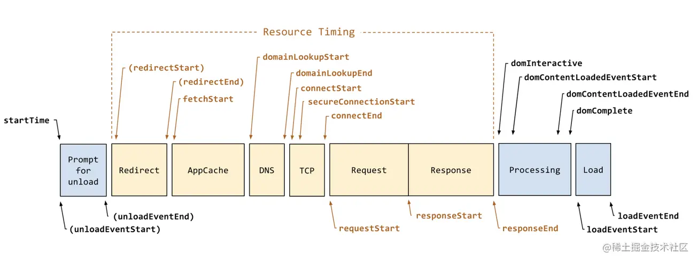
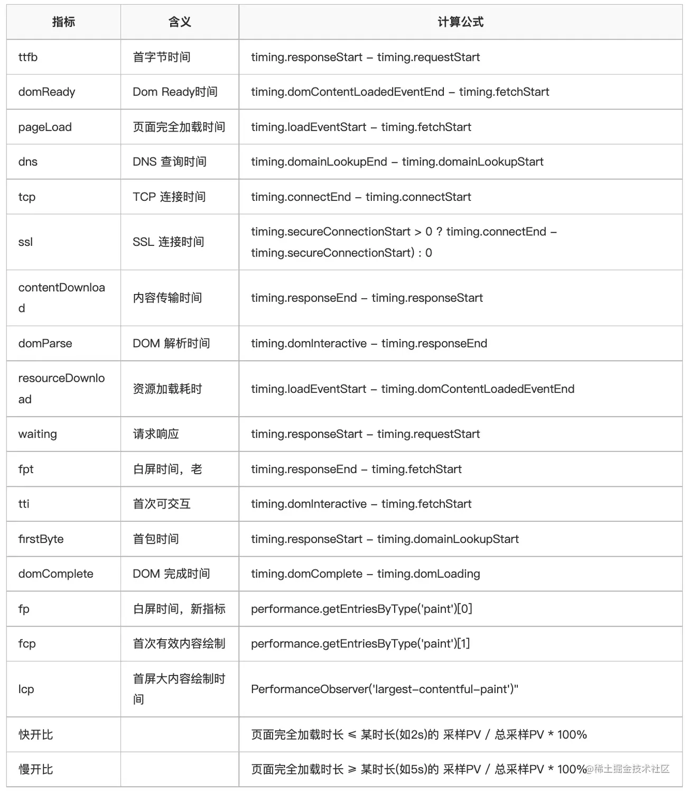

## 为什么要做优化

Global Web Performance Matters for ecommerce 的报告中指出

- 47%的用户更在乎网页在 2 秒内是否完成加载。
- 52%的在线用户认为网页打开速度影响到他们对网站的忠实度。
- 每慢 1 秒造成页面 PV 降低 11%，用户满意度也随之降低降低 16%。
- 近半数移动用户因为在 10 秒内仍未打开页面从而放弃。

## CSS 提高页面渲染速度

### 内容可见效(content-visibility)

> 我们可以使用 CSS 的`content-visibility`来跳过屏幕外的内容渲染。也就是说，如果你有大量的离屏内容（Off-screen Content），这将会大幅减少页面渲染时间

- 本质： **改变了一个元素的可见性，并管理其渲染状态**。

- 关键能力：**允许我们推迟我们选择的 HTML 元素渲染**

`content-visibility`会将分配给它的元素的高度（`height`）视为`0`，浏览器在渲染之前会将这个元素的高度变为`0`，从而使我们的页面高度和滚动变得混乱。但如果已经为元素或其子元素显式设置了高度，那这种行为就会被覆盖。如果你的元素中没显式设置高度，并且因为显式设置`height`可能会带来一定的副作用而没设置，那么我们可以使用`contain-intrinsic-size`作为一个占位符尺寸来替代渲染内容，来确保元素的正确渲染，同时也保留延迟渲染的好处。

```css
div {
  content-visibility: auto;
  contain-intrinsic-size: 200px; // 固有尺寸
}
```

_\* 但如果有大量的元素都设置了 content-visibility: auto，滚动条仍然会有较小的问题。_

`content-visibility`提供的另外两个值`visible`和`hidden`可以让我们实现像元素的显式和隐藏，类似于`display`的`none`和非`none`值的切换，它可以提高频繁显示或隐藏的元素的渲染性能，例如模态框的显示和隐藏。`content-visibility`可以提供这种性能提升，这要归功于其隐藏值（`hidden`）的功能与其他值的不同：

- `display: none`：隐藏元素并破坏其渲染状态。 这意味着取消隐藏元素与渲染具有相同内容的新元素一样昂贵
- `visibility: hidden`：隐藏元素并保持其渲染状态。 这并不能真正从文档中删除该元素，因为它（及其子树）仍占据页面上的几何空间，并且仍然可以单击。 它也可以在需要时随时更新渲染状态，即使隐藏也是如此
- `content-visibility: hidden`：隐藏元素并保留其渲染状态。这意味着该元素隐藏时行为和 `display: none` 一样，但再次显示它的成本要低得多

### 合理使用 will-change

以往在动画开发时，会使用 CSS 的 3D 变换（`transform`中的`translate3d()`或`translateZ()`）来开启 GPU 加速，但这会将元素和它的上下文提到另一个“层”，独立于其他元素被渲染。可这种将元素提取到一个新层，相对来说代价也是昂贵的，这可能会使 transform 动画延迟几百毫秒

现在可以直接使用 CSS 的`will-change`属性，该属性可以表明元素将修改特定的属性，让浏览器事先进行必要的优化

- 属性值：

  - `auto`：默认值，浏览器会根据具体情况，自行进行优化
  - `scroll-position`：表示开发者将要改变元素的滚动位置，比如浏览器通常仅渲染可滚动元素“滚动窗口”中的内容。而某些内容超过该窗口（不在浏览器的可视区域内）。如果 will-change 显式设置了该值，将扩展渲染“滚动窗口”周围的内容，从而顺利地进行更长，更快的滚动（让元素的滚动更流畅）
  - `content`：表示开发者将要改变元素的内容，比如浏览器常将大部分不经常改变的元素缓存下来。但如果一个元素的内容不断发生改变，那么产生和维护这个缓存就是在浪费时间。如果 will-change 显式设置了该值，可以减少浏览器对元素的缓存，或者完全避免缓存。变为从始至终都重新渲染元素。使用该值时需要尽量在文档树最末尾上使用，因为该值会被应用到它所声明元素的子节点，要是在文档树较高的节点上使用的话，可能会对页面性能造成较大的影响
  - `<custom-ident>`：表示开发者将要改变的元素属性。如果给定的值是缩写，则默认被扩展全，比如，`will-change`设置的值是 padding，那么会补全所有`padding`的属性，如 `will-change: padding-top, padding-right, padding-bottom, padding-left;`

- 使用：

  - 不要将 will-change 应用到太多元素上：浏览器已经尽力尝试去优化一切可以优化的东西了。有一些更强力的优化，如果与 will-change 结合在一起的话，有可能会消耗很多机器资源，如果过度使用的话，可能导致页面响应缓慢或者消耗非常多的资源。比如 `*{will-change: transform, opacity;}`
  - 有节制地使用：通常，当元素恢复到初始状态时，浏览器会丢弃掉之前做的优化工作。但是如果直接在样式表中显式声明了 will-change 属性，则表示目标元素可能会经常变化，浏览器会将优化工作保存得比之前更久。所以最佳实践是当元素变化之前和之后通过脚本来切换 will-change 的值
  - 不要过早应用 will-change 优化：如果你的页面在性能方面没什么问题，则不要添加 will-change 属性来榨取一丁点的速度。 will-change 的设计初衷是作为最后的优化手段，用来尝试解决现有的性能问题。它不应该被用来预防性能问题。过度使用 will-change 会导致大量的内存占用，并会导致更复杂的渲染过程，因为浏览器会试图准备可能存在的变化过程。这会导致更严重的性能问题。
  - 给它足够的工作时间：这个属性是用来让页面开发者告知浏览器哪些属性可能会变化的。然后浏览器可以选择在变化发生前提前去做一些优化工作。所以给浏览器一点时间去真正做这些优化工作是非常重要的。使用时需要尝试去找到一些方法提前一定时间获知元素可能发生的变化，然后为它加上 will-change 属性。

- 注意：
  建议在完成所有动画后，将元素的 will-change 删除

```js
var el = document.getElementById('element')

// 当鼠标移动到该元素上时给该元素设置 will-change 属性
el.addEventListener('mouseenter', hintBrowser)
// 当 CSS 动画结束后清除 will-change 属性
el.addEventListener('animationEnd', removeHint)

function hintBrowser() {
  // 填写上那些你知道的，会在 CSS 动画中发生改变的 CSS 属性名们
  this.style.willChange = 'transform, opacity'
}

function removeHint() {
  this.style.willChange = 'auto'
}
```

### 让元素及其内容尽可能独立于文档树的其余部分(contain)

> 属性 contain 允许我们指定特定的 DOM 元素和它的子元素，让它们能够独立于整个 DOM 树结构之外

让浏览器有能力只对部分元素进行重绘、重排，而不必每次针对整个页面。即，允许浏览器针对 DOM 的有限区域而不是整个页面重新计算布局，样式，绘画，大小或它们的任意组合。

属性值：

- `layout` ：该值表示元素的内部布局不受外部的任何影响，同时该元素以及其内容也不会影响以上级（容器的后代不应该导致其容器外元素的布局改变，反之亦然）
- `paint` ：该值表示元素的子级不能在该元素的范围外显示，该元素不会有任何内容溢出（容器的内容将永远不会绘制超出容器的尺寸，如果容器是模糊的，那么就根本不会绘制内容）
- `size` ：该值表示元素盒子的大小是独立于其内容，也就是说在计算该元素盒子大小的时候是会忽略其子元素（当其内容发生变化时，该容器不应导致页面上的位置移动）
- `content` ：该值是 `contain: layout paint` 的简写
- `strict` ：该值是 `contain: layout paint size` 的简写

### 使用 font-display 解决由于字体造成的布局偏移

Web 中使用非系统字体（@font-face 规则引入的字体）时，浏览器可能没有及时得到 Web 字体，就会让它用后备系统字体渲染，然后优化我们的字体。这个时候很容易引起未编排(Unstyled)的文本引起闪烁，整个排版本布局也看上去会偏移一下（FOUT）。

幸运的是，根据@font-face 规则，font-display 属性定义了浏览器如何加载和显示字体文件，允许文本在字体加载或加载失败时显示回退字体。可以通过依靠折中无样式文本闪现使文本可见替代白屏来提高性能。

CSS 的`font-display`属性有五个不同的值：

- `auto` ：默认值。典型的浏览器字体加载的行为会发生，也就是使用自定义字体的文本会先被隐藏，直到字体加载结束才会显示。即字体展示策略与浏览器一致，当前，大多数浏览器的默认策略类似 block
- `block` ：给予字体一个较短的阻塞时间（大多数情况下推荐使用 3s）和无限大的交换时间。换言之，如果字体未加载完成，浏览器将首先绘制“隐形”文本；一旦字体加载完成，立即切换字体。为此，浏览器将创建一个匿名字体，其类型与所选字体相似，但所有字形都不含“墨水”。使用特定字体渲染文本之后页面方才可用，只有这种情况下才应该使用 block。
- `swap` ：使用 swap，则阻塞阶段时间为 0，交换阶段时间无限大。也就是说，如果字体没有完成加载，浏览器会立即绘制文字，一旦字体加载成功，立即切换字体。与 block 类似，如果使用特定字体渲染文本对页面很重要，且使用其他字体渲染仍将显示正确的信息，才应使用 swap。
- `fallback` ：这个可以说是 auto 和 swap 的一种折中方式。需要使用自定义字体渲染的文本会在较短的时间不可见，如果自定义字体还没有加载结束，那么就先加载无样式的文本。一旦自定义字体加载结束，那么文本就会被正确赋予样式。使用 fallback 时，阻塞阶段时间将非常小（多数情况下推荐小于 100ms），交换阶段也比较短（多数情况下建议使用 3s）。换言之，如果字体没有加载，则首先会使用后备字体渲染。一旦加载成功，就会切换字体。但如果等待时间过久，则页面将一直使用后备字体。如果希望用户尽快开始阅读，而且不因新字体的载入导致文本样式发生变动而干扰用户体验，fallback 是一个很好的选择。
- `optional` ：效果和 fallback 几乎一样，都是先在极短的时间内文本不可见，然后再加载无样式的文本。不过 optional 选项可以让浏览器自由决定是否使用自定义字体，而这个决定很大程度上取决于浏览器的连接速度。如果速度很慢，那你的自定义字体可能就不会被使用。使用 optional 时，阻塞阶段时间会非常小（多数情况下建议低于 100ms），交换阶段时间为 0。

例：

```css
@font-face {
  font-family: 'Open Sans Regular';
  font-weight: 400;
  font-style: normal;
  src: url('fonts/OpenSans-Regular-BasicLatin.woff2') format('woff2');
  font-display: swap;
}
```

### 开启 GPU 渲染动画

浏览器针对处理 CSS 动画和不会很好地触发重排（因此也导致绘）的动画属性进行了优化。为了提高性能，可以将被动画化的节点从主线程移到 GPU 上。将导致合成的属性包括 3D transforms (`transform: translateZ()`, `rotate3d()`等)，`animating`， `transform` 和 `opacity`, `position: fixed`，`will-change`，和 `filter`。一些元素，例如 `<video>`, `<canvas>` 和 `<iframe>`，也位于各自的图层上。 将元素提升为图层（也称为合成）时，动画转换属性将在 GPU 中完成，从而改善性能，尤其是在移动设备上。

### 减少渲染阻止时间

Web 应用为了满足多种形式的需求，包括 PC、平板电脑和手机等，我们必须根据媒体尺寸编写新的样式。当涉及页面渲染时，它无法启动渲染阶段，直到 CSS 对象模型（CSSOM）已准备就绪。

可以根据表单因素将其拆分为多个样式表。在这种情况下，我们可以只让主 CSS 文件阻塞关键路径，并以高优先级下载它，而让其他样式表以低优先级方式下载。

```html
<!-- style.css contains only the minimal styles needed for the page rendering -->
<link rel="stylesheet" href="styles.css" media="all" />

<!-- Following stylesheets have only the styles necessary for the form factor -->
<link rel="stylesheet" href="sm.css" media="(min-width: 20em)" />
<link rel="stylesheet" href="md.css" media="(min-width: 64em)" />
<link rel="stylesheet" href="lg.css" media="(min-width: 90em)" />
<link rel="stylesheet" href="ex.css" media="(min-width: 120em)" />
<link rel="stylesheet" href="print.css" media="print" />
```

默认情况下，浏览器假设每个指定的样式表都是阻塞渲染的。通过添加 media 属性附加媒体查询，告诉浏览器何时应用样式表。当浏览器看到一个它知道只会用于特定场景的样式表时，它仍会下载样式，但不会阻塞渲染。通过将 CSS 分成多个文件，主要的 阻塞渲染 文件（本例中为 styles.css）的大小变得更小，从而减少了渲染被阻塞的时间。

### 升项目体验的案例和技术方案

- 直播活动，商品详情页访问量大，页面加骨骼屏，等待时间过长时 loading 引导客户先去其他活动转转，不让用户盲等。
- 对于无论是 H5 还是小程序，埋点数据全部走离线上传，把埋点队列里的埋点请求全部放在缓存里，一个一个慢慢发送慢慢吐泡泡，既保证了不与主流程业务请求竞争，也不会因为用户设备退出应用闪退，而侦测不到数据，因为下次进入时只要缓存里有没吐完的泡泡（埋点请求队列）就继续发送。
- 应用的业务 http 请求封装一层 熔断任务队列，增加重试机制，增加 token 自动刷新请求等等。
- 应用页面适当的缓动动画，不仅可以为请求数据争取时间，还可以提高用户体验，不那么突兀。
- H5 可使用龙骨动画、spine 动画，小程序可以使用帧动画、css animation 提高页面的动感，以及一定的互动营销效果。从实现和编码方面都比裸写 DOM 要好得多。

## H5 优化

### 客户端

- **HTML 预加载**

  通过配置由客户端提前下载好 HTML 主文档，当用户访问时直接使用已经下载好的 HTML 文档，以此减少 HTML 网络请求时间，从而提升网页打开速度。

- **HTML 预请求**

  在 webview 初始化同时，去请求 HTML 主文档，等待 HTML 文档下载完成 且 webview 初始成功后渲染，减少用户等待时间，客户端请求成功后，webview 加载本地 HTML，并保存以供下次使用。

- 预请求 VS 预加载

  本质上 HTML 预加载和 HTML 预请求的区别就是下载 HTML 文档的时机不同， 预加载是在 App 启动后用户无任何操作的情况下就会去下载，但是预请求只会在用户单击打开 H5 页面的时候才会去下载。如果用户是第二次打开某个 H5 页面，此时发现本地有已经下载好的 HTML 且尚未过期就会直接使用，这个时候的行为表现就跟预加载的功能是一致的了。

- **离线包**

  通过提前将 H5 页面内所需的 css、js 等资源聚合在一个压缩包内，由客户端在 App 启动后进行下载解压缩，在后续访问 H5 页面时，匹配是否有本地离线资源，从而加速页面访问速度。

- **接口预请求**

  通过客户端发起 H5 页面首屏接口请求，远比等待客户端页面初始化、下载 HTML、JS 下载执行的时机更提前，从而节省用户的首屏等待时间。在本地测试过程中发现接口预请求可提前 100+ms，用户也就可以更快的看到内容。

- **预渲染**

  客户端提前通过 webview 将页面渲染好，等待用户访问时，可直接展示。从而达到瞬开效果。但是这种功能肯定不能对所有的页面进行开放，而且存在一定的弊端。

  1. 会额外消耗客户端资源，需要在主线程空闲时执行，并需要控制预渲染的页面数量。
  2. 如果页面一进入就会下红包雨，这种页面是不适合做预渲染的，需要进行规避。

### H5

- **SSR 服务端渲染**

  一般情况下，一个 H5 页面的数据渲染完全由客户端来完成，先通过 AJAX 请求到页面数据并把相应的数据填充到模板，形成完整的页面来呈现给用户。而服务端渲染把数据的请求和模板的填充放在了服务端，并把渲染的完整的页面返回给客户端。

- **预渲染 HTML**
  通过 puppeteer 将 SPA 页面渲染出来并将 HTML 文档进行保存，配合上述页面刷新策略，并将 HTML 通过 CDN 进行托管，让你的 SPA 页面 像 SSR 一样丝滑。

  主要实现方案是通过基于 webpack 的插件 prerender-spa-plugin，并配置需要预渲染的路由，这样经过打包之后就会产出对应路由的页面。

- **CSS 优化**

  将首屏所需要的 css 文件通过内联方式内嵌到 HTML 中，由 SSR 服务一并返回，并对 css 文件进行拆分，按需加载

  阅读 next 源码发现了端倪，发现在打包时将所有的公共 css 通过 splitChunks 进行分组，由于项目中组件都是动态引入的，这里直接在 next.config.js 中修改 webpack 打包参数，将 splitChunks.cacheGroups.styles 配置删除，使用默认的 chunks: async 配置，即可实现按需引入

- **图片优化**

  - 避免图片 src 为空

  虽然 src 属性为空字符串，但浏览器仍然会向服务器发起一个 HTTP 请求，尤其是在 SSR 服务器压力扛不住的情况下，因此这里需要特别注意一下。

  - 图片压缩以及格式选择

  WebP 的优势体现在它具有更优的图像数据压缩算法，能带来更小的图片体积，而且拥有肉眼识别无差异的图像质量；同时具备了无损和有损的压缩模式、Alpha 透明以及动画的特性，在 JPEG 和 PNG 上的转化效果都相当优秀、稳定和统一。

  通过向图片服务器传递参数选择合适的分辨率

### 细节优化

#### 打包优化

页面组件拆分，优先加载首屏内容所需资源
webpack splitchunks 有效拆分公共依赖，提高缓存利用率
组件按需加载
Tree Shaking 缩减代码体积

#### 非关键 js 、 css 延迟加载

defer、async、动态加载 js
iOS 设备延迟加载 js

#### 媒体 资源加载 优化

图片、视频懒加载
资源压缩、通过向图片服务器传递参数选择合适的分辨率

#### 其他资源优化

数据埋点上报延迟发送，不阻塞 onload 事件触发
自定义字体优化，使用 fontmin 生成精简的字体包

#### 页面渲染优化

页面渲染时间优化
SSR 页面首屏 css 内联(Critial CSS)
合理使用 Layers
布局抖动优化：提前定好宽高
减少重排重绘操作

#### 代码层面优化

耗时任务分割
通过 Web Worker 减少主线程耗时
通过 RAF 回调，在线程空闲时执行代码逻辑
避免 css 嵌套过深

## 监控系统

### 关键结构

- **指标采集**：通过前端集成的 SDK 收集请求、性能、异常等指标信息；在客户端简单的处理一次，然后上报到服务器。

- **指标存储**：用于接收前端上报的采集信息，主要目的是数据落地。

- **统计与分析**：自动分析，通过数据的统计，让程序发现问题从而触发报警。人工分析，是通过可视化的数据面板，让使用者看到具体的日志数据，从而发现异常问题根源。

- **可视化展示**：通过可视化的平台；在这些指标（API 监控、异常监控、资源监控、性能监控）中，追查用户行为来定位各项问题。

### 架构图

- **采集层**：PC 和 H5 使用了一套 SDK 监听事件采集指标，然后将监听到的指标通过 REST 接口往 Logback 推送数据。Logback 以长连接的方式，会把这些不同类型的指标数据推送到 Flume 集群当中。Flume 集群会将这些数据，分发到 Kafka Topic 进行存储。
- **处理层**：由 Flink 去实时消费；Flink 会消费三种类型，分别是：离线数据落地、实时 ETL+图谱、明细日志。
- **存储层**：离线数据会存储到 HDFS 中；实时 ETL+图谱数据会存储到 MySQL 中；明细数据会落入到 ES 中。
- **统计层**：离线（DW、DM）、实时（分钟级->十分钟级->小时级）的方式，对指标进行汇总和统计。
- **应用层**：最后由接口去汇总表和明细 ES 里查询数据。
- **展示层**：然后前端输出图表、报表、明细、链路等信息。

### 数据采集

采集最初的愿景是希望对业务无侵入性，业务系统无需改造，只需要嵌入一段代码即可。所以这些采集，都是 SDK 自动化的处理。 SDK 会全局监听几个事件，分别为：错误监听、资源异常的监听、页面性能的监听、API 调用的监听。

通过这几项监听，最终汇总为 3 项指标的采集：

- 异常采集：调用 error / unhandledrejection 事件，用于捕获 JS、图片、CSS 等资源异常信息。
- 性能采集：调用浏览器原生的 performance.timing API 捕获页面的性能指标。
- 接口采集：通过 Object.defineProperty 代理全局的 XHR 用于捕获浏览器的 XHR/FETCH 的请求。

### 异常采集方案

#### 监听事件

```js
/**
监听 error、 unhandledrejection 方法处理异常信息
@param {Instance} instance SDK 实例
 */
export default function setupErrorPlugin(instance: Instance) {
  // JS 错误或静态资源加载错误
  on('error', (e: Event, url: any, lineno: any) => {
    handleError(instance, e, url, lineno)
  })
  // Promise 错误，IE 不支持
  on('unhandledrejection', (e: any) => {
    handleError(instance, e)
  })
}
```

#### 判断异常类型

```js
/** W3C 模式支持 ErrorEvent，所有的异常从 ErrorEvent 这里取
@param {MutationEvent} error 资源错误、代码错误
 */
function handleW3C(event: any) {
  switch (event.type) {
    // 判断脚本错误，还是资源错误
    case 'error':
      event instanceof ErrorEvent
        ? reportJSError(instance, event)
        : reportResourceError(instance, event)
      break // Promise 是否存在未捕获 reject 的错误
    case 'unhandledrejection':
      reportPromiseError(instance, event)
      break
  }
}
```

#### 捕获异常数据

```js
/** 上报 JS 异常
@param {Instance} instance SDK 实例
@param {ErrorEvent} event
 */
export default function reportJSError(
  instance: Instance,
  event: ErrorEvent
): void {
  // 设置上报数据
  const report = new ReportDataStruct('error', 'js')
  const errorInfo = event.error
    ? event.error.message
    : `未知错误：${event.message}`
  // 设置错误信息，兼容远程脚本不设置 Script error 导致的异常
  report.setData({
    det: errorInfo.substring(0, 2000),
    des: event.error ? event.error.stack : '',
    defn: event.filename,
    deln: event.lineno,
    delc: event.colno,
    rre: 1,
  })
}
```

#### 处理 IE 兼容问题

捕获异常时处理下 IE 的兼容性问题即可，IE 的方案如下：

```js
/** IE 8 的错误项，所以针对于 IE 8 浏览器，我们只需要获取到它出错了即可。
* 1. 错误消息
* 2. 错误页面
* 3. 错误行号（因为文件通常是压缩的，所以统计 IE8 的行号是没有任何意义的）
* @param {string} error 错误消息
* @param {string | undefined} url 异常的 URL
* @param {number | undefined} lineno 异常行数，IE 没有列数
*/
export function handleIE8Error(  error: string,  url?: string | undefined,  lineno?: number | undefined,) {
  return {
    colno: 0,
    lineno: lineno,
    filename: url,
    message: error,
    error: {
      message: error,
      stack: `IE8 Error：${error}`,
    },
  } as ErrorEvent;
}

/** IE 9 的错误，需要在 target 里面获取到
* @param { Element | any } error IE9 异常的元素
*/
export function handleIE9Error(error: any) {
  // 获取 Event
  const event = error.currentTarget.event;
  return {
    colno: event.errorCharacter,
    lineno: event.errorLine,
    filename: event.errorUrl,
    message: event.errorMessage,
    error: {
      message: event.errorMessage,
      stack: `IE9 Error：${event.errorMessage}`,
    }
  } as ErrorEvent;
}
```

### 性能采集方案

#### 浏览器页面加载过程

1. 卸载上一个文档
2. 重定向
3. 浏览器准备好使用 http 抓取文档
4. 检查本地缓存
5. 查询 DNS 域名
6. TCP 建立链接
7. HTTP 请求、响应
8. 渲染 DOM 树并解析
9. 网页开始加载资源
10. 准备就绪触发 load 事件执行回调函数

#### 性能指标获取方式

借助于浏览器原生的 Navigation Timing API 能够获取到上述页面加载过程中的各项性能指标数据，用于性能分析，它的时间单位是纳秒级。



当然也借助于 PerformanceObserver API 等用于测量 FCP、LCP、FID、TTI、TBT、CLS 等关键性指标。

#### 计算公式



#### 网络请求采集方案

网络请求，通过 Object.defineProperty 的方式对 XHR 做的代理

- 重写 XMLHttpRequest

```js
export function hook(proxy) {
  window[realXhr] = window[realXhr] || XMLHttpRequest
  XMLHttpRequest = function () {
    const xhr = new window[realXhr]()
    for (let attr in xhr) {
      let type = ''
      try {
        type = typeof xhr[attr]
      } catch (e) {}
      if (type === 'function') {
        this[attr] = hookFunction(attr)
      } else {
        Object.defineProperty(this, attr, {
          get: getterFactory(attr),
          set: setterFactory(attr),
          enumerable: true,
        })
      }
    }
    const that = this
    xhr.getProxy = function () {
      return that
    }
    this.xhr = xhr
  }
  return window[realXhr]
}
```

- 拦截所有请求

正常的情况下一个页面会请求多个接口，假如有 20 个请求； 我们期望在阶段性的所有请求都结束已后，汇总成一条记录合并上报，这样能有效减少请求的并发量。

```js
/** Ajax 请求插件 */
// 所有的数据请求，以及总量
let allRequestRecordArray: any = []
let allRequestRecordCount: any = []
// 成功的数据，200，304 的数据
let allRequestData: any = []
// 异常的数据，超时，405 等接口不存在的数据
let errorData: any = []
/** * 监听 Ajax 请求信息 *
 * * @param {Instance} instance SDK 实例
 * */
export default function setupAjaxPlugin(instance: Instance) {
  let id = 0
  proxy({
    onRequest: (config, handler) => {
      // 过滤掉听云、福尔摩斯、APM
      if (filterDomain(config)) {
        // 添加请求记录的队列
        allRequestRecordArray.push({
          id,
          timeStamp: new Date().getTime(), // 记录请求时长
          config, // 包含：请求地址、body 等内容
          handler, // XHR 实体
        })
        // 记录请求总数
        allRequestRecordCount.push(1)
        id++
      }
      handler.next(config)
    },
    // 失败时会触发一次
    onError: (err, handler) => {
      if (allRequestRecordArray.length === 0) {
        handler.next(err)
        return
      }
      for (let i = 0; i < allRequestRecordArray.length; i++) {
        // 当前的数据
        const currentData = allRequestRecordArray[i]
        if (
          currentData.handler.xhr.status === 0 && // 未发送
          currentData.handler.xhr.readyState === 4
        ) {
          errorData.push(
            JSON.stringify(handleReportDataStruct(instance, currentData))
          )
          allRequestRecordArray.splice(i, 1)
        }
      }
      sendAllRequestData(instance)
      handler.next(err)
    },
    onResponse: (response, handler) => {
      // 没有请求就返回 Null
      if (allRequestRecordArray.length === 0) {
        handler.next(response)
        return
      }
      for (let i = 0; i < allRequestRecordArray.length; i++) {
        // 当前的数据
        const currentData = allRequestRecordArray[i] // 只要请求加载完成，不管是成功还是失败，都记录是一次请求
        if (currentData.handler.xhr.readyState === 4) {
          // 正常的请求
          if (
            (currentData.handler.xhr.status >= 200 &&
              currentData.handler.xhr.status < 300) ||
            currentData.handler.xhr.status === 304
          ) {
            allRequestData.push(
              JSON.stringify(handleReportDataStruct(instance, currentData))
            )
          } else {
            if (currentData.handler.xhr.status > 0) {
              // 具备状态码              // 错误的请求
              errorData.push(
                JSON.stringify(handleReportDataStruct(instance, currentData))
              )
            }
          } // 删除当前数组的值
          allRequestRecordArray.splice(i, 1)
        }
      } // 发送数据
      sendAllRequestData(instance)
      handler.next(response)
    },
  })
}
function sendAllRequestData(instance) {
  if (
    allRequestData.length + errorData.length ===
    allRequestRecordCount.length
  ) {
    // 处理正常请求
    if (allRequestData.length > 0 || errorData.length > 0) {
      handleAllRequestData(instance)
    } // 处理异常请求
    if (errorData.length > 0) {
      handleErrorData(instance)
    } // 所有的数据请求，以及总量
    allRequestRecordArray = []
    allRequestRecordCount = [] // 成功的数据，200，304 的数据
    allRequestData = [] // 异常的数据，超时，405 等接口不存在的数据
    errorData = []
  }
}
```

#### 探针加载方案

- 同步加载：采集 SDK 放到所有 JS 请求头的前面；因为加载顺序的问题，如果放在其他 JS 请求之后，之前的 JS 出现了异常，就捕获不到了。因为要提前加载 JS 资源，会对性能有一定影响。
- 异步加载：采集 SDK 通过执行 JS 后注入到页面中；如果能保障首次的 JS 无异常，也可以使用异步的方式加载 SDK，对首屏优化有好处。

#### 数据过滤

- 屏蔽掉一些黑名单
- 指标的削峰填谷
- 应用信息的转换
- 客户端 IP 获取
- Token 的验证

### 整体规划

- 异常监控：异常影响的影响用户，资源加载异常感知，网络请求异常感知，代码报错异常感知，代码报错的细项 (SourceMap）分析
- 性能监控：性能值（首字节、DOMReady、页面完全加载、重定向、DNS、TCP.请求响应等耗肘），AP 监控（成功率、成功耗时、失败次数等）引用资源统计，和资源占比 (JS、CSS、图片、宇体、iFrame、Ajax 等等），位数对比，95%的用户、99% 的用户、平均用户
- 数据埋点：操作系统、分辨率、浏览器，事件分类（点击事件、 滚动事件），具体的指定的事件类型 （点击 Banner 图），事件发生时间，触发事件的位置(鼠标 X、Y，可生成热力图），访客标识，用户标识，链路采集
- 行为采集：进入页面，离开页面，点击元素，滚动页面，操作链路，自定义（如，点击广告位的圈），Chrome 插件直观看到埋点

## 错误监控

### 即使运行错误（代码）

- `try...catch`
- `window.onerror`

### 资源加载错误

- `object.onerror`
- `performance.getEntries()`
- `Error 事件捕获`

## 页面埋点

- PV / UV
- 停留时长
- 流量来源
- 用户交互

分类：

- 手写埋点：自主选择需要监控的数据然后在相应的地方写入代码。这种方式的灵活性很大，但是唯一的缺点就是工作量较大，每个需要监控的地方都得插入代码
- 无埋点：统计所有的事件并且定时上报。这种方式虽然没有前一种方式繁琐了，但是因为统计的是所有事件，所以还需要后期过滤出需要的数据

## 性能监控

对于性能监控来说，其实我们只需要调用 `performance.getEntriesByType('navigation')` 这行代码就行了

## 性能优化

### 资源

- 减少 http 请求次数和传输报文大小
- CSS Sprite（雪碧图，图片精灵）技术
- 图片懒加载（延迟加载）技术
- 音视频文件取消预加载（preload='none'），可以增加第一次渲染页面的速度，需要播放的时候在加载
- 客户端和服务器端的数据传输尽可能基于 JSON 格式完成，XML 格式比 JSON 格式要大一些
- 把页面中的 CSS/JS/图片等文件进行合并压缩
- 图片地图：对于多次调取使用的图片（背景图），尽可能把它提取成公共样式，而不是重新设置 background
- 图片 Base64 用 base64 码代表图片，减少 http 请求，增加浏览器渲染速度 但是代码恶心针对一些个别的加载速度很慢的图片可以使用

### 网络

- 把不经常更改的静态资源（js 库、图片等）做缓存处理（一般做的是 304 或者 Etag 等协商缓存）
- DNS 缓存或者预处理（DNS Prefetch），减少 DNS 的查找
- 设置本地的离线存储（Manifest）或者把一些不经常更改的数据做本地临时存储（webstorage、indexdb）等
- 部署 CDN（地域分布式服务器或者增加服务器）
- 建立 Connection:keep-alive TCP 长连接 和 Cache-Control 和 Expires Http 的强缓存
- 使用 http2 版本协议（好处：可以多条 TCP 通道共存 => 管道化链接）
- 一个项目分为不同的服务器。例如：资源 web 服务器、数据服务器、图片服务器、视频服务器、等，合理利用服务器资源，但是会导致过多的 DNS 解析

### 代码

- 减少直接对 DOM（减少 DOM 的回流和重绘），当代项目基本上都是基于 MVVM/MVC 数据驱动视图渲染，对 DOM 的操作框架会通过虚拟 DOM 进行 DOM Diff 精确渲染，性能要高效很多
- 减少对闭包的使用，过多的使用闭包会产生很多不销毁的内存，处理不当会导致内存溢出“栈溢出”
- 对于动画来说：能用 CSS 解决的不用 JS（能够用 transform 处理不使用传统 css 样式，transform 会开启硬件加速，不会引发回流），能用 reaquestAnimationFrame 解决的不用定时器
- 避免使用 iframe：iframe 会嵌入其他页面，会吧嵌入的页面也渲染了
- 低耦合高内聚（基于封装的方式减少页面中的冗余代码，提高代码使用率）
- 尽可能使用事件委托
- 避免出现死循环或者嵌套循环
- 项目中尽可能使用异步编程来模拟出多线程的效果，避免主线程阻塞（异步操作基于 Promise 设计模式来管理）
- JS 中不要使用 with （不知道是什么 但是性能特别差）
- 避免使用 CSS 表达式
- 函数的防抖和节流
- 减少使用 eval（主要原因是防止压缩代码的时候，由于符号书写不规范导致代码混乱） 性能消耗可忽略不计
- 减少 filter 滤镜的使用
- 尽可能减少 table 布局
- 尽可能减少选择器的层级（选择器是从右向左解析）
- 手动回收堆栈内存（赋值为 null）

## dead code

- ESlint: no-unused-vars rule（未使用的变量规则）
- webpack: webpack-deadcode-plugin（未使用的代码插件）
- TypeScript:

```js
// tsconfig
{
  "compilerOptions": {
    // ...otherOptions,
    "noUnusedLocals": true,
    "noUnusedParameters": true
  }
}
```

```js
npm install ts-prune --save-dev
```

```js
// package.json
{
  "scripts": {
    "find-deadcode": "ts-prune"
  }
}
```

- unused dependencies:

```js
npm install -g depcheck

npx depcheck
```
